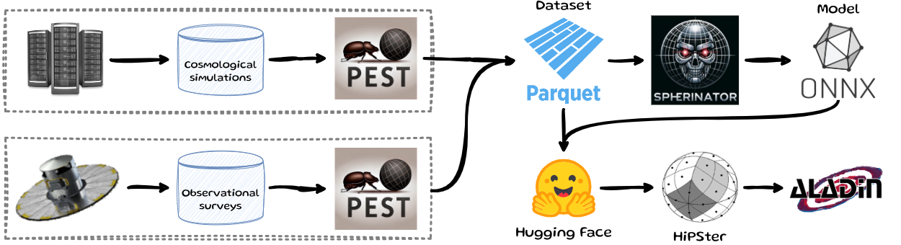

# PEST — Preprocessing Engine for Spherinator Training

PEST converts raw astrophysical simulation data into clean, structured training datasets for
[Spherinator](https://github.com/HITS-AIN/Spherinator) and [HiPSter](https://github.com/HITS-AIN/HiPSter).




```{toctree}
:maxdepth: 2
:hidden:

install
usage
api
```
